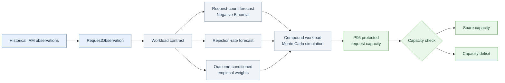

# IAMRequestDemand_capacity_optimization

An interpretable prototype for forecasting IAM request demand and translating
that demand into protected request capacity.

Modern IAM platforms can experience backend workload pressure without an
explicit estimate of the requests expected in the next planning period. This
project proposes a transparent alternative: estimate request volume, approval
outcomes, and request-level workload separately, then combine them in a
probabilistic capacity forecast.

> **Status:** portfolio research prototype. The experiments use reproducible
> synthetic data and are not a production-accuracy claim or a vendor-specific
> IAM connector.

## Model flow



Requests receive priority by construction. The capacity decision reserves a
chosen quantile of future request workload before reporting capacity that may
remain for other objects.

## Workload contract

For request `i`:

```text
w_i = w_i_pre + w_i_workflow + I(approved) * w_i_backend
w_i_backend  = sum_j(active_seconds_ij * capacity_units_ij)
w_i_workflow = workflow_overhead_seconds_i * workflow_capacity_units_i
```

Workflow-engine execution is charged to both approved and rejected requests.
Post-approval backend tasks are charged only when the request is approved.
Human approval waiting time is not active capacity workload unless the system
actually reserves a capacity unit during the wait.

For a future period `t`, the model simulates:

```text
W_t = sum_i(w_i,t)
C_requests,t = Q95(W_t)
C_spare,t    = max(0, C_total,t - C_requests,t)
C_deficit,t  = max(0, C_requests,t - C_total,t)
```

## Implementation

The model is dependency-free and split into small, inspectable components:

- `src/iam_workload_capacity_model/request_contract.py` — request and
  backend-task data contracts.
- `src/iam_workload_capacity_model/workload.py` — workload calculation,
  period aggregation, recency-weighted empirical distributions, and sampling.
- `src/iam_workload_capacity_model/forecast.py` — Negative Binomial request
  count, rejection-rate correction, and compound workload simulation.
- `src/iam_workload_capacity_model/capacity.py` — protected request capacity,
  spare capacity, and deficit.
- `src/iam_workload_capacity_model/flow.py` — parameterized orchestration.

The statistical baseline uses a Negative Binomial count model because IAM
request counts can be overdispersed relative to a Poisson model. The initial
fit is method-of-moments and the workload distributions retain observed
request weights rather than imposing a Normal distribution. A configurable
forgetting factor gives recent observations more influence.

## Reproduce the experiments

The code requires Python 3.11+ and has no runtime dependencies.

### Main capacity experiment

Generates 120 synthetic periods with approximately 200 requests per period,
about 11% rejection, and 10,000 future workload simulations:

```bash
PYTHONPATH=src python3 examples/run_capacity_experiment.py
```

### Walk-forward evaluation

Fits on the first 84 periods and evaluates the following 36 periods without
changing the main fitting flow:

```bash
PYTHONPATH=src python3 examples/run_walk_forward_evaluation.py
```

### Count-model scenarios

Compares the stationary Negative Binomial baseline with a seasonal variant
under stationary demand, weak/strong seasonality, and random shocks:

```bash
PYTHONPATH=src python3 examples/run_count_model_scenarios.py
```

### Minimal application boundary

The data-free wrapper in `examples/run_flow.py` shows how a real IAM adapter
would supply `RequestObservation` objects without putting provider data inside
the algorithm.

## Technical report

The focused report follows the implementation from input contract to capacity
decision and includes the formulas, experiment configuration, walk-forward
metrics, scenario comparison, and interpretation of the results:

- [Technical report PDF](output/pdf/iam_request_demand_capacity_report.pdf)
- [LaTeX source](docs/iam_request_demand_capacity_report.tex)

The report is the primary theoretical document for this repository. Generated
CSV files, JSON summaries, compiler intermediates, and exploratory documents
are intentionally excluded by `.gitignore`.

## Main synthetic result

The current reproducible experiment uses 3,000 capacity-unit seconds per
period. Its simulated P95 request workload is approximately 4,391 capacity
units, so the model reports a request-capacity deficit of approximately 1,391
units at the selected protection level. This is a demonstration of the
decision logic, not a claim about a real IAM installation.

The held-out walk-forward evaluation reports approximately:

| Metric | Result |
|---|---:|
| Request-count MAE | 60.88 requests |
| Request-count P95 coverage | 91.67% |
| Workload P50 MAE | 842.99 capacity units |
| Workload P95 coverage | 91.67% |
| Average-weight MAE | 0.52 units/request |

These results show both what the prototype can estimate and why real,
anonymized operational data is needed before making production claims.

## Scope and next step

The current repository does not include a vendor connector, queue simulation,
service-level objective, automated CI suite, or production deployment layer.
The next evidence needed is aggregated and anonymized IAM data: request counts
by period, approval outcomes, and active workload observations. Raw identities
and request payloads are not required by the modeling interface.
